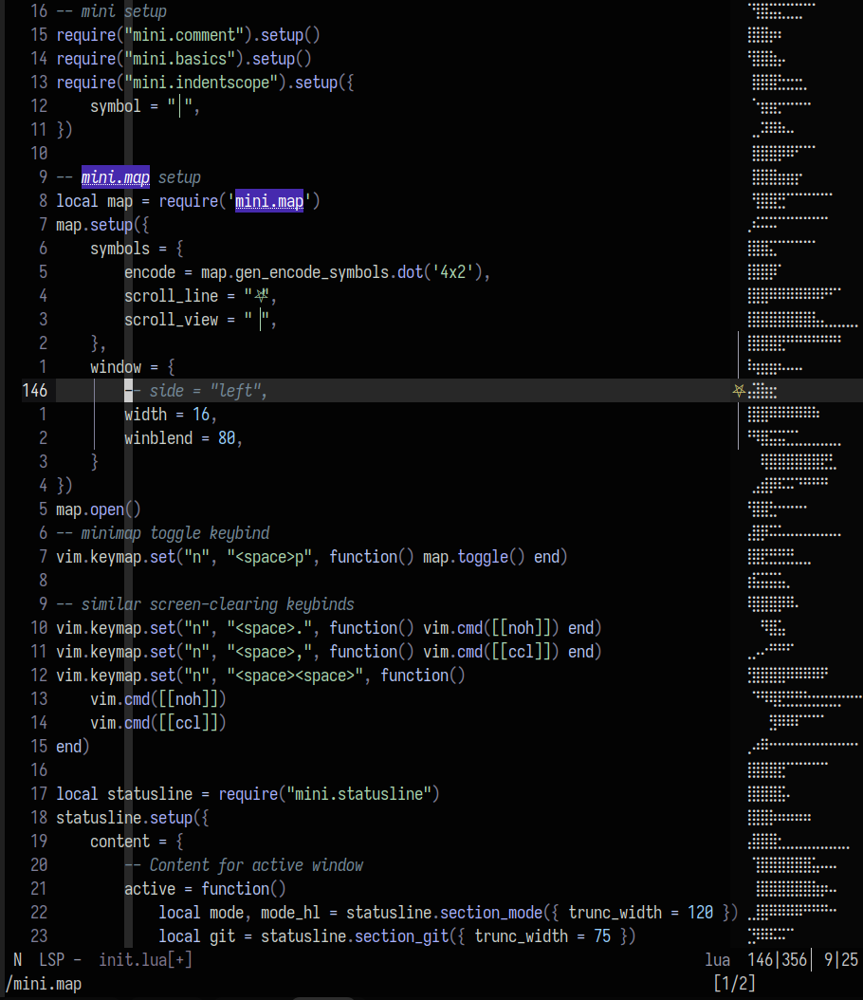

#### jdark.nvim

`:colo jdark`

Personal minimal neovim theme. Some Trouble and LSP support. Errors are green. Hints are magenta. Readable dark or inverted, high contrast for contextually interactive objects, low contrast otherwise. Color choices based on readability and gut feeling. Might use future work, serves me well for now.

`init.lua`: https://gist.github.com/junelva/fc1017ee4ea116d987f6abbcf38d3bb8

